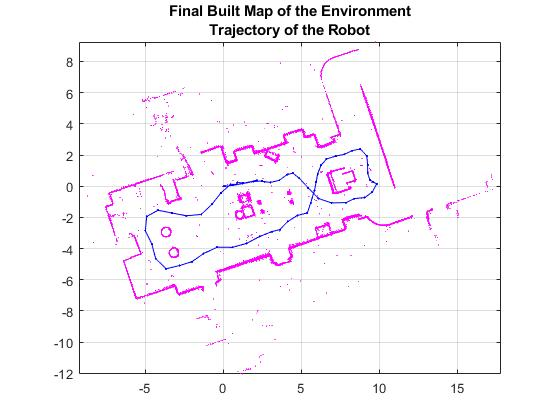

# SLAM_Pose_Graph_Optimization
 >The goal of this code implementation is to build a map of the environment using the lidar scans and retrieve the trajectory of the robot. To build the map of the environment, the SLAM algorithm incrementally processes the lidar scans and builds a pose graph that links these scans. The robot recognizes a previously-visited place through scan matching and may establish one or more loop closures along its moving path. The SLAM algorithm utilizes the loop closure information to update the map and adjust the estimated robot trajectory.

